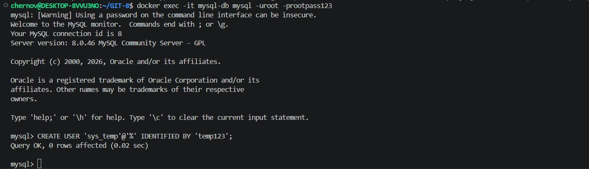
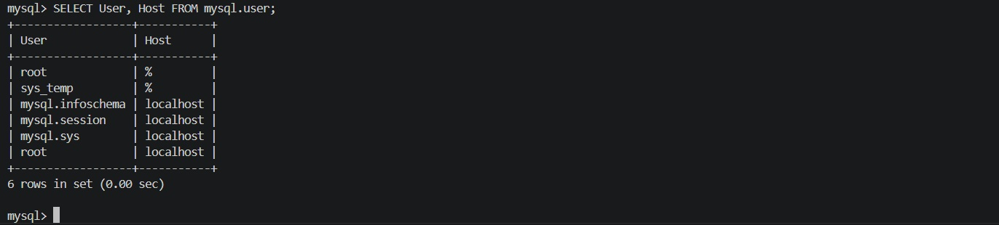
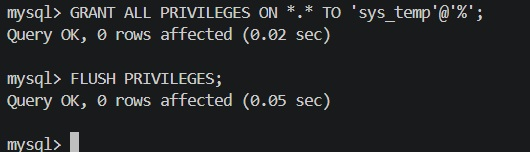
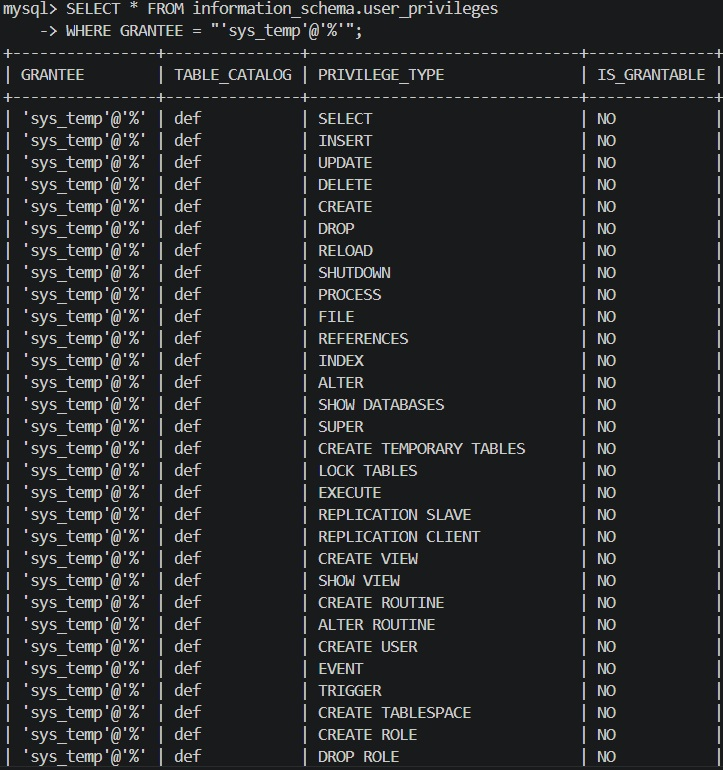
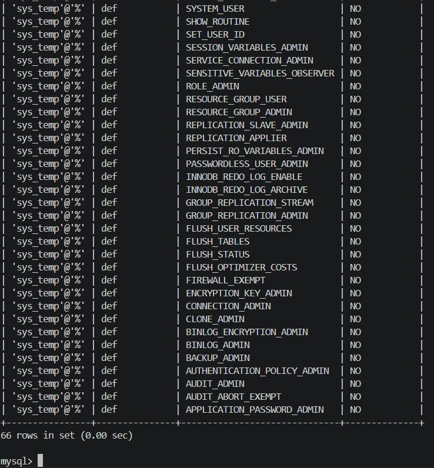
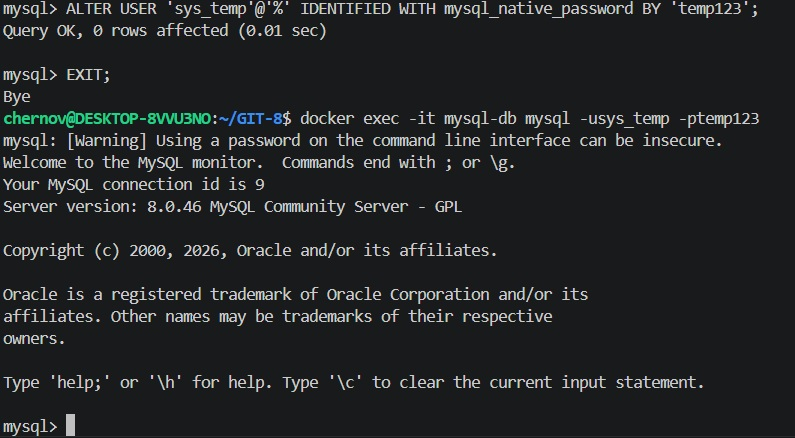
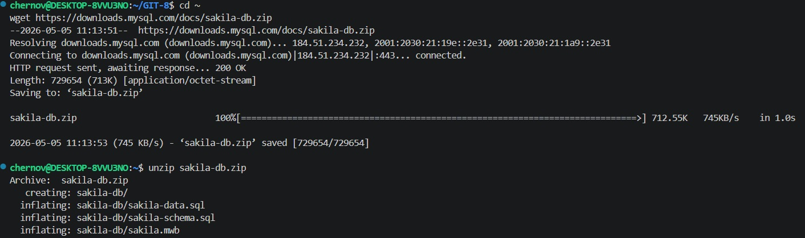
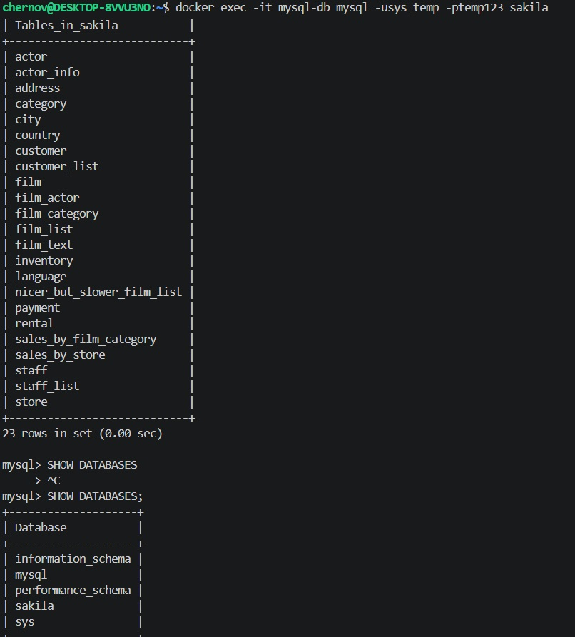
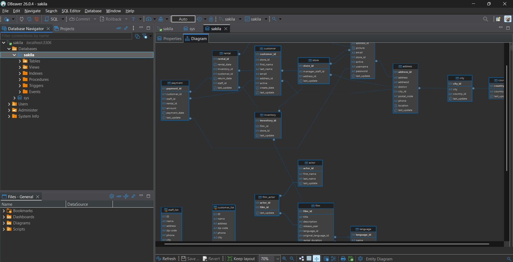
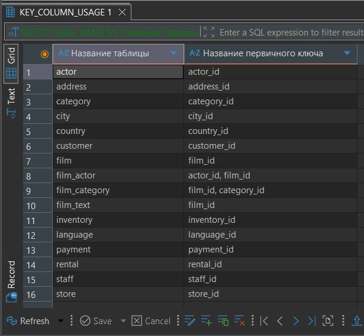

# Домашнее задание к занятию "`Работа с данными (DDL/DML)`" - `Chernov Vyacheslav`

Задание можно выполнить как в любом IDE, так и в командной строке.

## Задание 1
 1.1. Поднимите чистый инстанс MySQL версии 8.0+. Можно использовать локальный сервер или контейнер Docker.

 1.2. Создайте учётную запись sys_temp.

 1.3. Выполните запрос на получение списка пользователей в базе данных. (скриншот)

 1.4. Дайте все права для пользователя sys_temp.

 1.5. Выполните запрос на получение списка прав для пользователя sys_temp. (скриншот)

 1.6. Переподключитесь к базе данных от имени sys_temp.

Для смены типа аутентификации с sha2 используйте запрос:

```ALTER USER 'sys_test'@'localhost' IDENTIFIED WITH mysql_native_password BY 'password';```

 1.7. По ссылке https://downloads.mysql.com/docs/sakila-db.zip скачайте дамп базы данных.

 1.8. Восстановите дамп в базу данных.

 1.9. При работе в IDE сформируйте ER-диаграмму получившейся базы данных. При работе в командной строке используйте команду для получения всех таблиц базы данных. (скриншот)

Результатом работы должны быть скриншоты обозначенных заданий, а также простыня со всеми запросами.

## Задание 2.   
Составьте таблицу, используя любой текстовый редактор или Excel, в которой должно быть два столбца: в первом должны быть названия таблиц восстановленной базы, во втором названия первичных ключей этих таблиц. Пример: (скриншот/текст)

# Решение.

## Задание 1
 1.1. Поднимите чистый инстанс MySQL версии 8.0+. Можно использовать локальный сервер или контейнер Docker.
```
docker network create mysql-net

docker run -d \
  --name mysql-db \
  --network mysql-net \
  -e MYSQL_ROOT_PASSWORD=rootpass123 \
  -p 3306:3306 \
  mysql:8.0
```
 1.2. Создайте учётную запись sys_temp.
```
docker exec -it mysql-db mysql -uroot -prootpass123
```
```
CREATE USER 'sys_temp'@'%' IDENTIFIED BY 'temp123';
```


1.3. Выполните запрос на получение списка пользователей в базе данных. (скриншот)
```
SELECT User, Host FROM mysql.user;
```


1.4. Дайте все права для пользователя sys_temp.
```
GRANT ALL PRIVILEGES ON *.* TO 'sys_temp'@'%';
FLUSH PRIVILEGES;
```


1.5. Выполните запрос на получение списка прав для пользователя sys_temp. (скриншот)
```
SELECT * FROM information_schema.user_privileges 
WHERE GRANTEE = "'sys_temp'@'%'";
```




1.6. Переподключитесь к базе данных от имени sys_temp.
```
ALTER USER 'sys_temp'@'%' IDENTIFIED WITH mysql_native_password BY 'temp123';
```
```
docker exec -it mysql-db mysql -usys_temp -ptemp123
```


1.7. По ссылке https://downloads.mysql.com/docs/sakila-db.zip скачайте дамп базы данных.

```
wget https://downloads.mysql.com/docs/sakila-db.zip
unzip sakila-db.zip
```


1.8. Восстановите дамп в базу данных.
```
docker exec -i mysql-db mysql -usys_temp -ptemp123 < ~/sakila-db/sakila-schema.sql
docker exec -i mysql-db mysql -usys_temp -ptemp123 < ~/sakila-db/sakila-data.sql
```


1.9. При работе в IDE сформируйте ER-диаграмму получившейся базы данных. При работе в командной строке используйте команду для получения всех таблиц базы данных. (скриншот)



## Задание 2. Составьте таблицу, используя любой текстовый редактор или Excel, в которой должно быть два столбца: в первом должны быть названия таблиц восстановленной базы, во втором названия первичных ключей этих таблиц.

